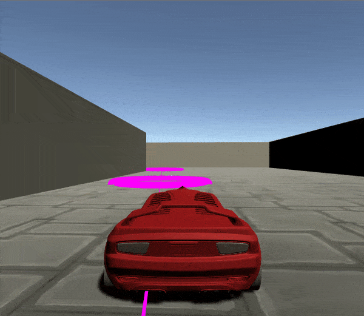

## Self-learned vehicle control using PPO

**Abstract**: This work tackles the completion of an obstacle maze by a selfdriving vehicle. We solve it combining two main ideas: First, we plan
an approximate path running Dijkstra on the environment’s Visibility
Graph. Second, a fully self-trained agent using PPO (Proximal Policy
Optimization) controls the vehicle making it follow the pre-computed
path the fastest way possible. Results show a high degree of environment
generalization achieved by training on randomized maps of increasing
difficulty (Curriculum Learning). Furthermore, our data-driven control
approach usually outperforms any of the other heuristic-based methods
attempted in both maze completion time and natural driving feel,
making us the team with lowest summed time added over all test
tracks.

Read our [blog post](https://campusai.github.io/experiments/autonomous_driving) or the [full report](report.pdf)
